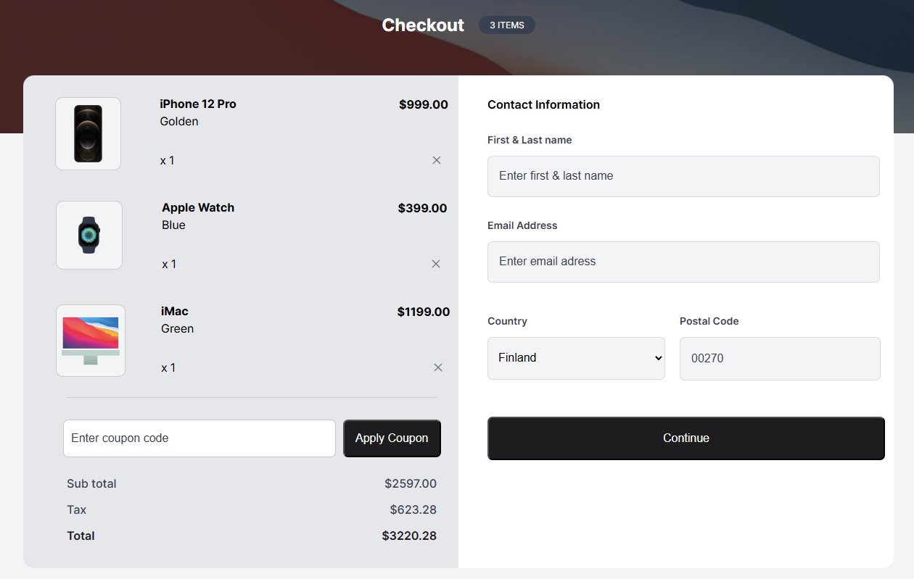

<h1 align="center">Device-Shop-Checkout-Project-1 | devChallenges</h1>

   Solution for a challenge <a href="https://devchallenges.io/challenge/apple-shop-checkout-page-challenge" target="_blank">Device Shop Checkout</a> from <a href="http://devchallenges.io" target="_blank">devChallenges.io</a>.

  <h3>
    <a href="https://project-1-device-shop-checkout.netlify.app/">
      Demo
    </a>
     | 
    <a href="https://github.com/aidamaloku/Device-Shop-Checkout-Project-1">
      Solution
    </a>
     | 
    <a href="https://devchallenges.io/challenge/apple-shop-checkout-page-challenge">
      Challenge
    </a>
  </h3>

<!-- TABLE OF CONTENTS -->

## Table of Contents

- [Overview](#overview)
  - [What I learned](#what-i-learned)
  - [Useful resources](#useful-resources)
- [Built with](#built-with)
- [Features](#features)
- [Acknowledgements](#acknowledgements)
- [Author](#author)
- [Reflection & Progress](#reflection-&-progress)

<!-- OVERVIEW -->

## Overview

This project is an Apple shop checkout page built with HTML and CSS. It features two main sections: a product summary and a contact form where users can enter their name, email, and country. The goal of the project is to practice layout techniques using Flexbox. It was built as part of a frontend challenge to strengthen HTML and CSS skills.

### What I learned

Throughout this project, I gained a better understanding of flexbox, positioning, and how to overlay backgrounds.
I encountered some difficulties with centering elements and realized that I need to invest more time in planning how to structure the project layout—both horizontally and vertically. This will help me avoid issues and reduce the need for manual adjustments with margins and padding to achieve proper alignment.

### Useful resources

- MDN Web Docs : for HTML and CSS reference
- W3Schools : for HTML and CSS reference

### Built with

- Semantic HTML5 markup
- CSS custom properties
- Flexbox
- Custom CSS Properties

## Features

This site was created as a submission to a [DevChallenges](https://devchallenges.io/challenges-dashboard) challenge.

## Acknowledgements

The course I took at Digital Learning Hub laid the foundation for my understanding of HTML and CSS, while the YouTube course by <a href="https://youtu.be/G3e-cpL7ofc?si=DJpaxBdoFtuAD_lU">SuperSimpleDev</a> further strengthened and deepened my knowledge.

## Author

- GitHub [@aidamaloku](https://github.com/aidamaloku)

## Reflection & Progress

Starting from this project, each future README will include a section reflecting on what I learned and how it connects to or improves upon my previous projects.